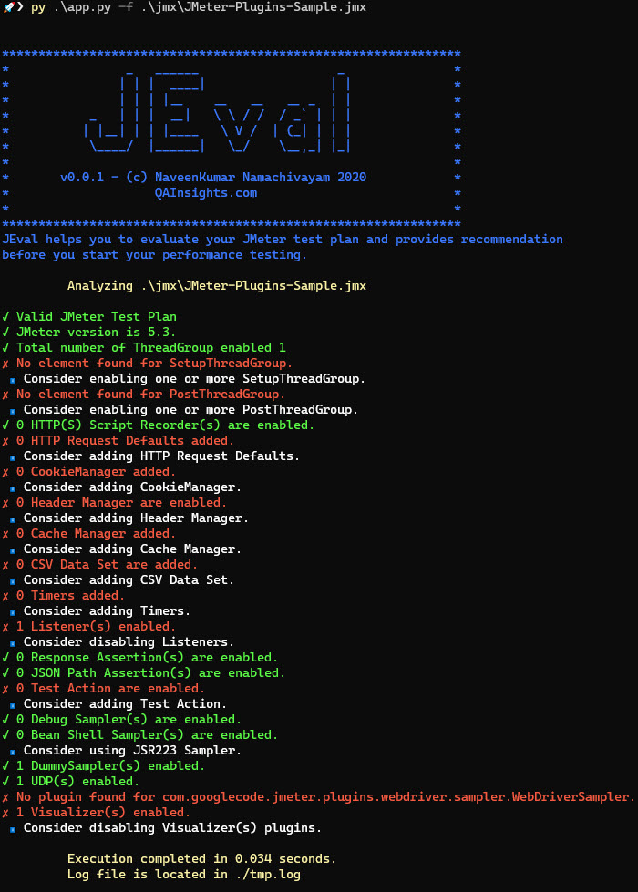

# 🚀 JEval

<pre>
***************************************************************
*                _   ______                   _               *
*               | | |  ____|                 | |              *
*               | | | |__    __   __   __ _  | |              *
*           _   | | |  __|   \ \ / /  / _` | | |              *
*          | |__| | | |____   \ V /  | (_| | | |              *
*           \____/  |______|   \_/    \__,_| |_|              *
*                                                             *
*            (c) NaveenKumar Namachivayam 2020                *
*                       QAInsights.com                        *
*                                                             *
***************************************************************
</pre>

JEval helps you to evaluate your JMeter test plan and provides recommendation before you start your performance testing.

# 🛠 Prerequisites

* Clone this repository.
* Install the latest version of Python
* Install the dependencies  
`pip install -r requirements.txt`

**Important Notes**  
* *JEval doesn't make any modifications to your JMeter test plan. But it is advisable to make a backup of your JMeter test plan.*
* *JEval utility doesn't collect any sort of data*

# ✨ Usage

* cd into the repository
* Issue the below command  
`python app.py -f <JMeter-File-Path>  

## 💪 Output

# ✍ Log file

To view the log, open the `tmp.log` file.

# ✔ Features

* JEval detects the JMeter version and validates the test plan.

* JEval detects following JMeter elements
  - AuthManager
  - CookieManager
  - HeaderManager
  - CacheManager
  - CSVDataSet  
  - TransactionController  
  - ConfigTestElement
  - ConstantTimer
  - UniformRandomTimer
  - GaussianRandomTimer
  - Arguments
  - ProxyControl
  - RegexExtractor
  - TestAction
  - BeanShellSampler
  - JSR223Sampler
  - IfController
  - LoopController
  - ResultCollector
  - ResponseAssertion
  - XPath2Assertion
  - JSONPathAssertion
  - DebugSampler

If you want to add custom elements, you can add it in the `config.yaml` file. 

# 🛑 Limitations

* Doesn't detect JMeter plugins yet.

# 💰 Donate
☕ <a target="_blank" href="https://www.buymeacoffee.com/qainsights">Buy me a tea</a>
